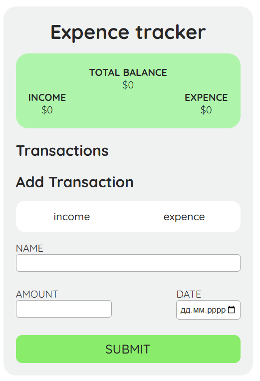
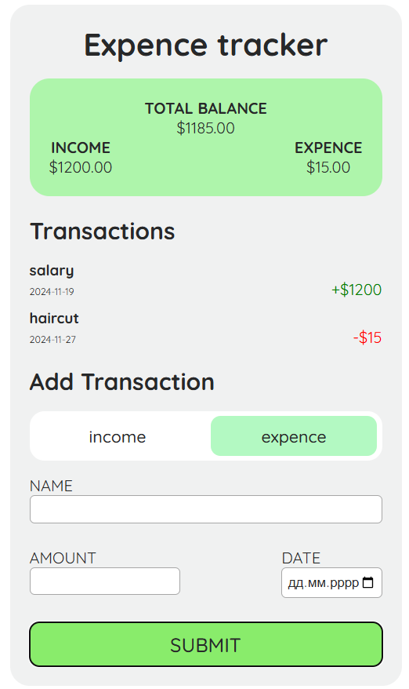

### Personal Finance Tracker
A simple web application to track your income, expenses, and overall financial balance. It provides a user-friendly interface for managing personal finances effectively.

## Features
* Add Transactions: Record income and expenses with details like name, amount, and date.
* Income & Expense Categorization: Separate transactions by type (income or expense).
* Dynamic Balance Calculation: Automatically updates the total balance, total income, and total expenses after each transaction.
* Validation Checks
* Error Handling: Alerts the user for invalid inputs or insufficient balance for expenses.

## Technologies Used
* HTML5: Structure of the application.
* CSS3: Styling for a clean and intuitive interface.
* JavaScript (Vanilla): Core logic for interactivity and data handling.

## Usage
1. Select Transaction Type:
    * Click on either the "Income" or "Expense" button to specify the type of transaction.
2. Fill in Transaction Details:
    * Provide a name, amount, and date for the transaction.
3. Add Transaction:
    * Click the "Add" button to record the transaction. Ensure all fields are valid.

## Validation Rules
* Name: Must be at least 3 characters long.
* Amount: Must be a positive number.
* Date: Cannot be a future date.
* Expense Limitation: Expenses cannot be added if the current balance is insufficient.

## Screenshots

## Author
* Oleksandra Friz
A software engineering student aspiring to become a front-end developer.